# HomeLab-Kubernetes-Cluster-Setup Cilium

A home lab build of a multi-node Kubernetes cluster running on KVM virtual machines, designed as a personal playground for learning and experimenting with cloud-native networking. The cluster is fully automated, from VM provisioning via cloud-init to cluster initialization  and uses Cilium as the single networking component, replacing kube-proxy, the Ingress controller, and the load balancer.

This lab is the hands-on implementation of concepts explored in the Isovalent labs:
- [Cilium Gateway API](https://isovalent.com/labs/cilium-gateway-api/)
- [Cilium LB IPAM & L2 Announcements](https://isovalent.com/labs/cilium-lb-ipam-l2-announcements/)

---

## Architecture




Cilium is the only networking component in this cluster — it handles three roles that would normally require separate tools:

| Role | Replaced by |
|---|---|
| kube-proxy (iptables service routing) | Cilium eBPF — kernel-level, no iptables |
| Ingress controller (nginx / traefik) | Cilium Gateway API controller + embedded Envoy |
| Load balancer (MetalLB / cloud LB) | Cilium LB IPAM + L2 ARP announcement |

---

## Repository structure
```
.
├── 01-hypervisor-setup/       # KVM/libvirt installation, base image download
├── 02-vm-provisioning/        # VM creation scripts (automated + manual)
│   └── scripts/
│       ├── create-node-auto.sh    # Full cloud-init automated provisioning
│       └── create-vm-v1.sh        # Base VM only — manual setup required
└── 03-k8s-cluster/            # Cluster bootstrap, Cilium install, L2 LB config
```

---

## How to use this

Follow the folders in order — each one picks up where the previous left off.

**`01-hypervisor-setup`** — Start here if your host has no KVM installed. Covers the full libvirt stack installation, group permissions, and downloading the Ubuntu 22.04 cloud image that all VMs are built from.

**`02-vm-provisioning`** — Creates the actual VMs. Two options: a fully automated script that uses cloud-init to configure the node on first boot (recommended), or a manual path where you SSH in and run the steps yourself. Either way, both master and worker nodes come out with swap disabled, containerd configured, and Kubernetes binaries installed.

**`03-k8s-cluster`** — Bootstraps the cluster. Covers kubeadm init, Cilium installation with kube-proxy replacement and Gateway API enabled, joining worker nodes, and setting up the L2 load balancer IP pool.

---

## What's next

This cluster is intended as a long-term playground and a work in progress—stay tuned for more labs and deep dives!
